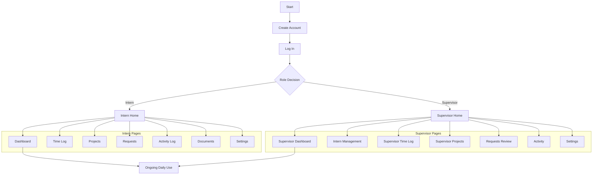

# IMS Navigation Workflow (Role-Based)

## Summary
This workflow defines the user journey after account actions:

`Create Account -> Log In -> Route by Role -> Use Role-Specific Pages`

The goal is to ensure users land only on pages that match their account role.

## Core Flow
1. User creates an account.
2. User logs in.
3. System checks the account role.
4. If role is `Intern`, route to intern experience pages.
5. If role is `Supervisor`, route to supervisor experience pages.

## Role Page Groups
### Intern Pages
- Dashboard
- Time Log
- Projects
- Requests
- Activity Log
- Documents
- Settings

### Supervisor Pages
- Supervisor Dashboard
- Intern Management
- Supervisor Time Log
- Supervisor Projects
- Requests Review
- Activity
- Settings

## Mermaid Flowchart

## SOP (Short)
### Step 1: Create Account
- Expected User Action: User submits registration details and selects a valid role.
- Expected System Response: System creates account record and confirms successful registration.

### Step 2: Log In
- Expected User Action: User enters credentials and signs in.
- Expected System Response: System authenticates credentials and loads user profile, including role.

### Step 3: Role Decision
- Expected User Action: User waits for post-login routing.
- Expected System Response: System evaluates role and routes user to role-specific landing page.

### Step 4A: Intern Route
- Expected User Action: Intern uses intern modules.
- Expected System Response: System shows only intern page group and intern navigation paths.

### Step 4B: Supervisor Route
- Expected User Action: Supervisor uses supervisor modules.
- Expected System Response: System shows only supervisor page group and supervisor navigation paths.

### Fallback: Invalid Role or No Role Mapping
- Expected User Action: User acknowledges access issue and follows prompt.
- Expected System Response:
  - Show access error message (e.g., role not mapped).
  - Perform safe redirect to a default route (login or role-safe dashboard).
  - Prevent access to mixed or unauthorized page groups.

## Test Plan
Validate routing behavior for the following scenarios:
1. Newly created Intern account.
2. Newly created Supervisor account.
3. Existing Intern login.
4. Existing Supervisor login.
5. Non-matching role/page access attempt.

## Acceptance Criteria
- Role decision is explicit after login.
- Each role lands on the correct page set.
- No mixed intern/supervisor navigation paths are accessible.

## Assumptions and Defaults
- This workflow is documentation-only; no code changes are included.
- Roles are only `Intern` and `Supervisor`.
- Page names follow current IMS module naming.

